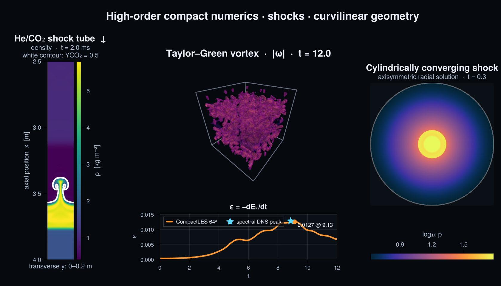

# CompactLES

[](https://stillyslalom.github.io/CompactLES.jl/dev/)
[](https://github.com/stillyslalom/CompactLES.jl/actions/workflows/CI.yml?query=branch%3Amain)



*CompactLES output: Taylor–Green vorticity magnitude, a He/CO₂
shock–interface interaction (white: `Y_CO₂ = 0.5`), and an axisymmetric
cylindrical converging shock. At `64³`, the measured Taylor–Green dissipation
peak is `ε = 0.01265` at `t = 9.13`, compared with the pseudo-spectral result
`ε = 0.01289` at `t = 8.86` from
[van Rees et al. (2011)](https://doi.org/10.1016/j.jcp.2010.11.031).
Reproduce the figure with
[`docs/figures/readme_header.jl`](docs/figures/readme_header.jl).*

A compressible large-eddy-simulation / direct-simulation solver for the
multicomponent Navier–Stokes equations, inspired by 
[Pyranda](https://github.com/LLNL/pyranda), written in pure Julia. It combines
high-order compact (Padé) finite differences with Cook-style artificial fluid
properties for shock and subgrid regularization, and runs on shared-memory
threads and distributed MPI ranks. Beyond the standard libraries its only
dependencies are `MPI.jl` and `ThreadPinning.jl`, the latter used by the cluster
topology probe. HDF5 output and Makie plotting are weak dependencies, available
once you load HDF5 or a Makie backend yourself.

The frontend separates the physical specification (a `Problem`: gas model,
geometry, boundary conditions, and initial state) from the discretization (a
`Numerics`: resolution, scheme order, CFL, and process grid). The same problem
can therefore be evaluated at different resolutions or scheme orders without
modification.

```julia
using MPI; MPI.Init(threadlevel=:funneled)
using CompactLES

prob = Problem(
    domain = ((0.0, 2π), (0.0, 2π), (0.0, 2π)),
    bcs    = ntuple(_ -> (PeriodicBC(), PeriodicBC()), 3),
    ic     = (x, y, z) -> Prim(u=(sin(x)*cos(y), -cos(x)*sin(y), 0.0),
                               p=71.43, rho=1.0))

solver, Q = setup(prob, Numerics(n_global=(64, 64, 64)))
run!(solver, Q; tfinal=1.0)
```

## Features

- **High-order compact spatial operators.** Sixth-order tridiagonal Lele
  derivatives by default; a tenth-order pentadiagonal derivative is available,
  and the operator interface accepts custom compact schemes. An eighth-order
  Gaitonde–Visbal compact filter provides dealiasing and near-wall dissipation
  control.
- **Shock and subgrid capturing.** Cook (2007) artificial shear viscosity,
  bulk viscosity, conductivity, and species diffusivity, driven by
  high-derivative sensors — no Riemann solvers or flux limiters.
- **Multicomponent thermodynamics.** Any number of species, each with its own
  transport equation, behind a pluggable equation-of-state interface. Three
  models ship: a calorically perfect `IdealMixture`, a `Nasa9Mixture` with
  piecewise temperature-dependent specific heats read from the bundled NASA CEA
  database, and a `StiffenedGas` for condensed materials.
- **Mixing diagnostics as output.** Volume integrals, plane-averaged profiles,
  mix width, molecular mixing fraction, composition PDFs, Favre turbulent
  kinetic energy, and resolved dissipation — metric-aware and MPI-reduced.
- **Curvilinear geometry.** Cartesian, cylindrical (r, θ, z), and spherical
  (r, θ, φ) coordinates, with regularized treatment of the cylindrical axis and
  the spherical origin and poles. Collapsed dimensions provide efficient 1-D and 2-D
  (including axisymmetric-with-swirl) runs.
- **Stretched meshes.** Per-dimension monotone grid clustering that composes
  with any coordinate system.
- **Boundary conditions.** Periodic, slip / no-slip (adiabatic or isothermal)
  walls, Navier–Stokes characteristic boundary conditions (NSCBC) for subsonic
  inflow and outflow, and time-dependent Dirichlet forcing (pistons,
  oscillating drivers, supersonic inflow).
- **Parallelism.** MPI 3-D domain decomposition with a distributed
  tridiagonal / pentadiagonal solve for the globally coupled compact schemes,
  plus shared-memory threading over grid lines.
- **I/O.** Dependency-free per-rank checkpoint/restart and parallel VTK
  (`.pvtr`) output for ParaView / VisIt.

## Installation

CompactLES is a Julia package targeting Julia ≥ 1.9 and `MPI.jl` v0.20. From the
repository root:

```
julia --project=. -e 'using Pkg; Pkg.instantiate()'
```

`MPI.jl` provides an MPI binary by default, so initial use does not require a
system MPI installation.

## Running

Serial or shared-memory threaded (set `-t` to the thread count):

```
julia --project=. -t auto examples/taylor_green.jl
```

Distributed with MPI (`-n` ranks, each with `-t` threads):

```
mpiexec -n 8 julia --project=. -t 2 examples/taylor_green.jl
mpiexec -n 4 julia --project=. -t 2 examples/shock_tube.jl
mpiexec -n 2 julia --project=. -t 2 examples/piston_driver.jl
```

If `mpiexec` is not on `PATH`, obtain the launcher configured for `MPI.jl`:

```
julia --project=. -e 'using MPI; print(MPI.mpiexec(f -> f))'
```

Each rank's local extent in every decomposed dimension must be at least 9 (the
filter closure plus the stencil width). Choose the process grid (`dims=` in
`Numerics`) so that thin dimensions are not split too finely.

## Specifying a problem

Problems are described in **primitive, pointwise** terms and never reference
ranks, halos, or the conserved-variable layout.

A **`Prim`** is a pointwise state — velocity, pressure, composition, and exactly
one of temperature or density (the EOS supplies the other):

```julia
Prim(; u=(0,0,0), p, T_ion=NaN, rho=NaN, Y=(1.0,))
```

A **`Problem`** bundles the physics and geometry:

```julia
prob = Problem(
    eos       = single_species(gamma=1.4),          # or IdealMixture([...])
    transport = Transport(mu0=1/1600, Pr=0.7, Sc=0.7),  # viscosity, Prandtl, Schmidt
    metric    = CartesianMetric(),                  # or Cylindrical/Spherical
    sources   = (ConstantBodyForce((0.0, -9.81, 0.0)),),
    domain    = ((0.0, 1.0), (0.0, 1.0), (0.0, 1.0)),  # (lo, hi) per dimension
    bcs       = ((SlipWallBC(), NSCBCOutflowBC(pinf=0.1)),
                 (PeriodicBC(), PeriodicBC()),
                 (PeriodicBC(), PeriodicBC())),
    ic        = (x, y, z) -> Prim(u=(0,0,0), p=1.0, rho=1.0))
```

A **`Numerics`** bundles the discretization and runtime choices:

```julia
num = Numerics(
    n_global        = (256, 64, 64),      # global grid
    deriv           = lele_d1_6(),        # or lele_d1_10(), or a custom scheme
    filt            = compact_filter(0.45),
    art             = ArtParams(enabled=true),   # Cook artificial properties
    cfl             = 0.5,
    control         = StepControl(retries=4),    # roll back and lower cfl on failure
    filter_interval = 1,                  # filter every N steps (0 disables)
    filter_cfl      = 0.0,                # 0 → filter per application; see below
    dims            = nothing,            # process grid; nothing → auto
    stretch         = (nothing, nothing, nothing))  # optional grid clustering
```

`setup` combines the two specifications and returns the solver with its
initialized conserved state; `run!` advances that state:

```julia
solver, Q = setup(prob, num)
workspace = Workspace(Q)  # retain stage arrays for reuse/splitting/IMEX
run!(solver, Q; workspace, tfinal=0.25, nmax=100_000,
     callback=(solver, Q) -> ...)
```

For progress reporting, `ProgressLog` provides a callback that prints the step,
time, `dt`, wall time per step, completion percentage, projected finish, and an
optional scalar diagnostic:

```julia
run!(solver, Q; tfinal=0.25,
     callback=ProgressLog(every=10, tfinal=0.25, label="TKE",
                          quantity=turbulent_kinetic_energy))
```

`quantity` runs on every rank and may reduce; only the printing is rank-guarded.
Each line is flushed so that progress remains visible through a batch launcher.
`imbalance=true` adds the minimum and maximum step times across ranks.
`run!` records `solver.wall_step` and `solver.wall_total` whether or not anything
reports them.

Initial-condition and Dirichlet-forcing functions are plain, pure functions of
physical coordinates (and time, for forcing). A convergence study evaluates the
same `Problem` with a sequence of `Numerics` values.

## Capabilities at a glance

| Category        | Provided |
|-----------------|----------|
| Derivatives     | `lele_d1_6` (C6, tridiagonal), `lele_d1_10` (C10, pentadiagonal), `pade_d1_4`, custom `CompactScheme` / `BandedCompactScheme` |
| Filter          | `compact_filter(alphaf)` — eighth-order Gaitonde–Visbal, boundary cascade; larger `alphaf` is weaker. By default it is applied at full strength every `filter_interval` steps, so its dissipation is a per-application amount and scales with the step count rather than with elapsed time; `filter_cfl` relaxes each pass in proportion to the timestep and makes it a rate instead — see [CALIBRATION.md](reference/CALIBRATION.md) |
| Time integration| Five-stage fourth-order low-storage Carpenter–Kennedy Runge–Kutta (LSRK(5,4)) |
| Geometry        | `CartesianMetric`, `CylindricalMetric`, `SphericalMetric`; collapsed 1-D/2-D; `Stretch` / `sine_cluster` meshes |
| Walls           | `SlipWallBC`, `NoSlipWallBC(Twall=...)` (adiabatic or isothermal) |
| Open boundaries | `NSCBCOutflowBC(pinf=...)`, `NSCBCInflowBC(u=..., T_ion=..., Y=...)`, `ExtrapolationBC` |
| Forcing         | Typed source tuples (`ConstantBodyForce`) and time-dependent `DirichletBC` |
| Singular axes   | `AxisBC` (cylindrical axis), `OriginBC` (spherical origin), `PoleBC` (spherical poles) |
| Thermodynamics  | `IdealMixture`, `Nasa9Mixture` / `read_nasa9` (NASA CEA piecewise cp), `StiffenedGas`; EOS interface for custom models |
| Regularization  | Cook artificial μ\*, β\*, κ\*, D\* (`ArtParams`), with an optional compression-keyed β\* sensor and a choice of sensor field, high-pass and test filter — see [CALIBRATION.md](reference/CALIBRATION.md) |
| Diagnostics     | `volume_integral`, `plane_profile`, `mix_width`, `molecular_mixing`, `species_pdf`, `tke_profile`, `dissipation_rate` |
| Failure handling| `StepControl` timestep floors (incl. a `PLANCK_TIME` failsafe), positivity checking, rollback-with-CFL-backoff, and an optional state floor that counts and repairs unphysical cells (`floor_ratio`, `FloorTally`); `SolverFailure` |
| Run control     | `Callback` with `AtTime` / `EveryTime` (both landed on exactly), `EveryStep`, or `WhenState` triggers; `ProgressLog` for progress/timing output; `SwitchableBC` for boundaries that change mid-run |
| State queries   | `refresh_primitives!`, `mixture_density`, `velocity`, `mass_fraction`, `boundary_plane`, for reading the in-flight state independently of the conserved layout |
| I/O             | `save_checkpoint` / `load_checkpoint!`, `save_vtk` (field selection, derived fields, rectilinear or curvilinear grid), `FieldWriter` (numbered frames + `.pvd` time collection) |

## Timestep and CFL near coordinate singularities

Resolved-angle polar grids impose timestep restrictions that are absent from
collapsed-coordinate calculations. `compute_dt` uses physical spacings:
`inv_h` includes the metric scale factor and any stretching Jacobian. The
estimate therefore remains conservative near a coordinate singularity, but the
computational cost differs among three regimes:

- **Collapsed angular dimension** (1-D radial, axisymmetric, axisymmetric with
  swirl): the skipped dimension contributes no advective
  term, so `dt` is set by the radial spacing exactly as in a Cartesian run.
  Consequently, `examples/converging_shock.jl` retains an ordinary timestep as
  the shock reaches the axis.
- **Resolved θ in cylindrical**: the azimuthal spacing is r·Δθ, so at the first
  half-offset node (r ≈ R/2N_r) the acoustic limit is tighter than the radial
  one by roughly N_θ/π. With N_θ = 64 that is a ~20× penalty, and it is a
  property of the polar grid, not of this implementation — every explicit polar
  solver pays it.
- **Spherical**: the origin and poles impose simultaneous restrictions. The φ
  spacing is r·sinθ·Δφ, which approaches zero both as r → 0 and as sinθ → 0;
  at the first node off a pole, sinθ ≈ Δθ/2.

The diffusive limit degrades faster still (it scales with the *square* of the
inverse spacing), and artificial bulk viscosity peaks exactly where a
converging shock reaches the axis. Resolved-angle calculations may therefore
require one of the standard remedies:
azimuthal mode truncation or radius-dependent filter strength near the axis, an
implicit/IMEX treatment of the azimuthal direction, or local time stepping.
None is implemented here.

In collapsed angular dimensions, the timestep loop skips the angular direction,
but the geometric source ρu_θ²/r can still drive u_r stiffly at small r. For
axisymmetric flow with swirl, the omitted rate is
|u_θ|/r, which at the first node is the same order as the radial acoustic rate —
large enough to consume the CFL margin if omitted from the estimate.
`curvature_rate` adds it (cylindrical and spherical, only for collapsed angular
dimensions, since resolved ones already cover it through the advective term).

`dt_report(solver, Q)` names the global limiter — value, owning rank, index,
physical coordinates, direction, and whether it is acoustic, diffusive, or
curvature-driven. Periodic evaluation can distinguish a physical timestep limit
from one imposed by azimuthal spacing near a singularity.

## Examples

| File | Demonstrates |
|------|--------------|
| `examples/taylor_green.jl`     | Taylor–Green vortex at Re = 1600; periodic box, kinetic-energy diagnostic |
| `examples/shock_tube.jl`       | He-driven Richtmyer–Meshkov shock tube in SI units; multicomponent EOS, artificial properties, closed reflecting tube, optional NSCBC outflow |
| `examples/piston_driver.jl`    | Oscillating full-state Dirichlet driver with non-reflecting NSCBC outflow |
| `examples/converging_shock.jl` | Cylindrically converging shock; 1-D radial run on the regularized axis |

## Output and restart

- **Checkpoints:** `save_checkpoint(solver, Q, "prefix")` writes one dependency-free
  binary file per rank; `load_checkpoint!(solver, Q, "prefix")` restores it. Restarts
  require the same global grid and decomposition. The header also records the
  species set, the metric, the EOS and the grid coordinates, so a solver the file
  does not describe is rejected rather than misread; a file written before those
  fields existed is rejected as well, since it cannot be checked against them.
- **Shared-file checkpoints:** with `using HDF5`, `save_checkpoint_hdf5` writes the
  state as one global array in a single `.h5`, and `load_checkpoint_hdf5!` restores
  it onto **any** rank count and process grid. This is the form to use when a run
  may be resumed at a different scale, or on a machine with a different node count.
  HDF5 is a weak dependency, so the package core stays dependency-free.
- **Visualization:** `save_vtk(solver, Q, "prefix")` writes one piece per rank plus
  a parallel container on the physical grid, including stretch mappings. Open the
  container in ParaView or VisIt. A grid with a resolved angular dimension is
  written as a curvilinear `.pvts` with explicit Cartesian positions and rotated
  velocity, so a cylindrical or spherical run renders as an annulus or shell;
  every other grid is written as a rectilinear `.pvtr`.
- **Shared-file dumps:** with `using HDF5`, `save_hdf5(solver, Q, "prefix")` writes
  one `.h5` per frame however many ranks there are, plus an XDMF3 `.xmf` sidecar
  to open in ParaView or VisIt. It takes the same `fields` and `stride` as
  `save_vtk` and follows the same rectilinear/curvilinear rule.
- **Field selection:** `save_vtk(...; fields = (:rho, :velocity, :schlieren, :sensor))`.
  Besides the primitives, several derived fields are available at little cost
  from state the solver already holds: `:vorticity`, `:qcriterion`,
  `:divergence`, `:mach`, `:schlieren` (|∇ρ|), and the artificial-property
  internals `:sensor`, `:strain_mag`, `:mu_art`, `:beta_art`, `:kappa_art`,
  `:D_art`, which report the local action of the regularization.
- **Subsampling:** `save_vtk(...; stride = 4)`, or a per-dimension 3-tuple. Points
  are selected on the *global* index, so the per-rank pieces remain aligned and
  still tile. This reduces file size rather than compute, since the fields are
  still built over the whole block before sampling; at 512³ a stride of 4 reduces
  a 2.7 GB dump to 43 MB.
- **Slicing:** `save_vtk(...; slice = (3, 256))` writes only the plane at global
  index 256 of dimension 3. A mid-plane of a 512³ run is 1/512 of the data, which
  makes a frequent 2-D time series affordable where a 3-D one is not. Only
  the ranks spanning the plane write anything. Composes with `stride`, and works
  the same way in `save_hdf5` and `FieldWriter`.
- **Time series:** `Callback(EveryTime(Δt), FieldWriter("out/field"))` dumps on an
  evenly spaced *time* schedule, with `run!` shortening the last few steps so
  that one ends exactly at each instant, and writes an `out/field.pvd` collection
  recording each frame's physical time. Open the `.pvd` to animate against time
  rather than frame index.

## Testing

Three suites, ordered so a failure points at one layer:

```
julia --project=. test/runtests.jl                      # serial unit tests
mpiexec -n 4 julia --project=. -t 1 test/mpi_tests.jl   # distributed
julia --project=. -t auto test/convergence.jl           # order studies
julia --project=. -t auto test/validation.jl            # shock-capturing battery
```

The serial suite covers operator accuracy (spectral convergence of the compact
derivatives, C10-vs-C6, the transposed y/z path), closed-domain closure
exactness, filter behavior, the coordinate-singularity folds, freestream
preservation in every metric (Cartesian, cylindrical, spherical, stretched,
axis, origin+poles), EOS round-trips, discrete conservation, NSCBC, checkpoint
round-trips, and a full Sod shock tube validated against the exact Riemann
solution. The MPI suite exercises the code paths that only run when a dimension
is split across ranks: the distributed spike solve (tridiagonal and
pentadiagonal), cross-rank halo exchange, off-rank folds, the discrete
geometric conservation law (GCL) across rank boundaries, and telescoping flux
conservation. The multi-rank suite
exits nonzero on any failure, so it is CI-gateable.

Coverage is measured with `julia --code-coverage=user` over all three suites
(and the MPI suite at multiple rank counts), then summarized by
`bench/coverage.jl`. The executable-line denominator must be considered with the
percentage: Julia marks lines in never-compiled methods as non-executable, so an
untested function can be omitted from the denominator. For example, `io.jl` and
`nscbc.jl` once reported 100% while `save_vtk` and the complete
`NSCBCInflowBC` path had not been compiled. Additional tests may therefore
increase the executable-line count; that increase represents newly exercised
code.

`test/validation.jl` is the shock-capturing battery: Lax and Sedov–Taylor and
Noh against closed-form solutions, Shu–Osher and Woodward–Colella against stored
high-resolution profiles from this code. The distinction is explicit because
only comparison with an independent solution tests absolute accuracy. Noh is run in
all three geometries, which makes it the sharpest available probe of the axis
and origin folds under a strong shock; its wall-heating value is sensitive to
changes in the artificial-viscosity constants.
`reference/CALIBRATION.md` documents what those constants do, measured with
`bench/artcal.jl` over the same cases, including two identified operating limits:
strong shocks require `cfl ≤ 0.15`, and the spherical origin
needs its initial data resolved over at least three cells.

`test/convergence.jl` is the slower second line of defence: it prints *observed*
orders and guards them against regression. Measured on the current code, in the
max norm: ≈6 for `lele_d1_6` and ≈10 for `lele_d1_10` in the periodic interior,
but only ≈3 wherever a boundary closure or a coordinate-singularity fold is
active — closed domains, the cylindrical axis, the spherical origin. The error
there is dominated by the first node or two off the wall or axis, which is also
why the fold tolerances in the serial suite are looser than the interior ones.
The reduced order is a property of the closure cascade. A collapsed slope
(approximately 0 rather than 3) indicates a fold-sign error: such an error
produces O(1) error at the first node and localizes the fault to the antipodal
sign tables. Set `CL_RUN_TG=1` to add the Taylor–Green Re = 1600 dissipation
history.

## Status and limitations

This is research code under active development. The core solver — compact
operators, LSRK(5,4) integration, artificial properties, multicomponent transport,
the curvilinear metrics, and the distributed solve — is covered by the test
suites above and validated against analytic references (Sod, freestream, rigid
rotation, manufactured fold solutions).

The coordinate-singularity machinery for the *fully resolved* spherical origin
and poles (as opposed to the widely used cylindrical axis) is the newest and
least-exercised part of the code; the full-ball origin+poles combination in
particular warrants scrutiny before production use. Other current limitations:

- Float64 only.
- Strong shocks need `cfl ≤ 0.15`, well below the 0.5 default. The state loses
  positivity at the symmetry plane while the shock forms there, in the wall,
  axis or origin cell rather than ahead of the front.
  `StepControl(retries = 4)` rolls back the state and lowers the CFL
  automatically. A timestep predictor, a larger `C_beta`, and a wider sensor
  reach have each been measured against this and none moves the ceiling;
  `ArtParams(beta_sensor = :gated_strain)` moves it to 0.2 for the cylindrical
  geometry only. `ArtParams(detector = :d8)`, the reference implementation's
  eighth-derivative ringing detector, removes the restriction altogether at the
  planar wall and the cylindrical axis and tightens it at the spherical origin;
  it is not yet the default. See [CALIBRATION.md](reference/CALIBRATION.md).
- Converging-shock runs carry cells of negative internal energy for their whole
  duration, at the wall and travelling with the front, while density and total
  energy stay positive and the Noh plateau still comes out to within 0.07%.
  `StepControl(floor_ratio = 1e-8)` counts them and reports the totals in
  `solver.floor_tally`; `floor_scope = :internal_energy` additionally repairs
  them, which on Noh ν = 1 is a percent-level intervention that terminates the
  run. Both are off by default. See
  [CALIBRATION.md](reference/CALIBRATION.md).
- The spherical origin will not take an initial discontinuity resolved over
  fewer than about three cells, nor a flow that converges to a singular state
  at t = 0. The cylindrical axis takes both.
- The NASA CEA transport table is bundled for provenance, but `Transport` still
  uses constant properties; its coefficient reader and mixture rules are not
  implemented.
- NSCBC inflow transverse-term accounting is not yet implemented (outflow
  has it).
- There is no GPU path.
- VTK output is one file per rank per frame, which does not survive large rank
  counts, and adjacent pieces abut without ghost overlap, so cell-based filters
  may show seams at rank boundaries. The shared-file HDF5/XDMF path avoids both,
  but only for single dumps: a `FieldWriter` time series is VTK, since XDMF has
  no equivalent of the `.pvd` frame list.
- The dependency-free binary checkpoints restart only onto the rank count and
  decomposition that wrote them. HDF5 checkpoints restore onto any, and are the
  form to use when a run may be resumed at a different scale.
- HDF5 writes have been exercised only through the serialized token-relay
  fallback. Selecting the collective backend requires a parallel libhdf5 built
  against the run's MPI; `hdf5_parallel()` reports which one this build selects,
  and it is `false` for the JLL that a workstation installs by default.
- Wall boundary conditions assume coordinate-surface walls.
- Soret/Dufour effects and reacting-chemistry models are not implemented;
  reactions can use the typed source interface.

## Learn more

The [development documentation](https://stillyslalom.github.io/CompactLES.jl/dev/)
covers the established frontend, compact operators, parallel decomposition,
runtime diagnostics, and validation workflow. See [DESIGN.md](reference/DESIGN.md) for a
deeper walkthrough of the solver mechanics and the parts of the physics
architecture that are still evolving.
